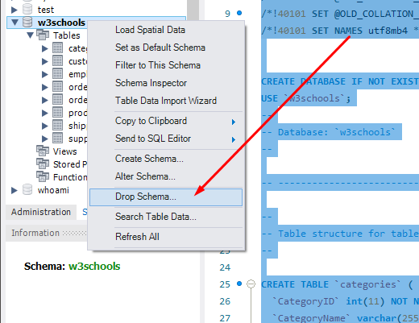

# Projeto MySQL Vocabulary booster

Projeto feito como critério avaliativo na escola de programação **Trybe**.

Projeto feito para praticar querys em um banco de dados relacional SQL. Nele foi possível aprender manipular dados presentes em tabelas diferentes, utilizando
métodos JOIN e UNION, manipulações de strings e operações aritméticas, agrupamento de dados com GROUP BY juntamente com funções utilizadas em dados agrupados 
(AVG, MIN, MAX, SUM e COUNT), criação de PROCEDURES, FUNCTIONS e TRIGGERS utilizando o MySQL Workbench.

## Instruções para reproduzir o projeto

### Pré requisitos

1. Possuir `mysql-server` e `MySQL Workbench` instalados

2. Clone o repositório
  * `git clone git@github.com:Kevin-Ol/project-mysql-vocabulary-booster.git`.
  * Entre na pasta do repositório que você acabou de clonar:
    * `cd mysql-vocabulary-booster`

3. Instale as dependências
  * `npm install`

---

### Instruções para restaurar os bancos de dados `w3schools` e `hr`

1. Faça o download dos arquivos de backup [aqui](w3schools.sql) e [aqui](hr.sql) clicando em "Raw", depois clicando com botão direito e selecionando "Salvar como" para salvar os arquivos em seu computador.

2. Abra o MySQL Workbench.

3. Abra uma nova janela de query e cole dentro dela todo o conteúdo do arquivo `w3schools.sql`.

4. Selecione todo o código com o atalho `CTRL-A` e clique no ícone de trovão para executar o script.

    

5. Aguarde alguns segundos (espere em torno de 30 segundos antes de tentar fazer algo).

6. Clique no botão apontado na imagem a seguir para atualizar a listagem de banco de dados:

    

7. Verifique se o banco restaurado possui todas as seguintes tabelas:

    

8. Clique com botão direito em cada tabela e selecione "Select Rows". Certifique-se de que todas as tabelas possuem registros. Se alguma estiver vazia ou ausente, faça o passo a seguir. Caso contrário, vá direto para o passo 10.

9. Caso haja tabelas faltando, delete o banco de dados clicando com o botão direito em cima do banco de dados `w3schools` e selecione a opção `Drop Schema...`. Refaça os passos anteriores, desta vez aguardando um tempo maior quando executar o script de restauração.

    

10. O mesmo processo mencionado anteriormente também deve ser feito para restaurar o banco `hr`. Verifique se o banco `hr` restaurado possui todas as tabelas indicadas na imagem abaixo. Se alguma estiver vazia ou ausente, faça o passo a seguir. Caso contrário, vá direto para a próxima seção.

    

11. Caso haja tabelas faltando, delete o banco de dados clicando com o botão direito em cima do banco de dados `hr` e selecione a opção `Drop Schema...`. Refaça o passo anterior, desta vez aguardando um tempo maior quando executar o script de restauração.

---


### Instruções para testar queries

Para executar localmente os testes, é preciso escrever o seguinte no seu terminal:
```sh
MYSQL_USER=<SEU_NOME_DE_PESSOA_USUARIA> MYSQL_PASSWORD=<SUA SENHA> HOSTNAME=<NOME_DO_HOST> npm test
```

Ou seja, suponha que para poder acessar a base de dados feita neste projeto você tenha `root` como seu nome de pessoa usuária, `password` como senha e `localhost` como host. Logo, você executaria:
```sh
MYSQL_USER=root MYSQL_PASSWORD=password HOSTNAME=localhost npm test
```

Usando o exemplo anterior de base, suponha que você não tenha setado uma senha para `root`. Neste caso, você executaria:
```sh
MYSQL_USER=root MYSQL_PASSWORD= HOSTNAME=localhost npm test
  ```

## Requisitos do projeto

1 - Exiba os países e indicando se cada um deles se encontra ou não na região formada pela Europa (banco `hr`)

2 - Exiba os cargos com seu nível de renumeração associado, com base no salário máximo do cargo (banco `hr`)

3 - Exiba os cargos com a diferença entre seus salários máximo e mínimo (banco `hr`)

4 - Exiba a média salarial e o nível de senioridade de todas as pessoas empregadas, agrupadas pelo cargo (banco `hr`)

5 - Exiba os cargos com sua variação salarial e suas médias máxima e mínima mensal, considerando salários máximo e minímo como anuais (banco `hr`)

6 - Faça um relatório que mostra o histórico de cargos das pessoas empregadas (banco `hr`)

7 - Faça um relatório que mostra o histórico de cargos das pessoas empregadas que iniciaram seus cargos nos meses de janeiro, fevereiro ou março (banco `hr`)

8 - Exibe todas as **pessoas consumidoras** cujos pedidos já foram enviados pelas empresas `"Speedy Express"` ou `"United Package"` (banco `w3schools`)

9 - Exibe todos as pessoas funcionárias que já realizaram algum pedido, mostrando também seu total de pedidos feitos (banco `w3schools`)

10 - Exibe todos os produtos que já foram pedidos, que possuem uma média de quantidade nos pedidos registrados acima de `20.00` (banco `w3schools`)

11 - Exibe todas as pessoas clientes **que possuem compatriotas**, mostrando a quantidade de compatriotas para cada pessoa cliente (banco `w3schools`)

12 - Faça um relatório que lista todas as pessoas funcionárias **que possuem o mesmo cargo** (banco `hr`)

13 - Exibe todos produtos **que já tiveram um pedido associado requerindo uma quantidade desse produto maior que 80** (banco `w3schools`)

14 - Considerando o conjunto formado pelas pessoas consumidoras e empresas fornecedoras de produtos, queremos saber quais são os cinco primeiros países distintos, em ordem alfabética, presentes nesse conjunto (banco `w3schools`)

15 - Crie uma procedure chamada `buscar_media_por_cargo` que recebe como parâmetro o nome de um cargo e em retorno deve mostrar a média salarial de todas as pessoas que possuem esse cargo (banco `hr`)

16 - Crie uma função chamada `buscar_quantidade_de_empregos_por_funcionario` no banco de dados `hr` que, ao receber o **email de uma pessoa funcionária**, retorne a quantidade de empregos **presentes em seu histórico** (banco `hr`)

17 - Crie uma TRIGGER que, a cada nova inserção realizada na tabela `orders`, insira automaticamente a data atual na coluna `OrderDate` (banco `w3schools`)

18 - Faça um relatório que mostra o **histórico de cargos das pessoas empregadas**, mostrando as datas de início e de saída, assim como os anos que ela ficou nesse cargo (banco `hr`)

19 - Crie uma função chamada `exibir_quantidade_pessoas_contratadas_por_mes_e_ano` no banco de dados `hr` que, dados o mês e ano como parâmetros nessa ordem, retorna a quantidade de pessoas funcionárias **que foram contratadas** nesse mês e ano (banco `hr`)

20 - Toda pessoa funcionária no banco `hr` possui um histórico completo de cargos. Logo, crie uma procedure chamada `exibir_historico_completo_por_funcionario` que, dado o e-mail de uma pessoa funcionária, retorna todos os cargos em seu histórico (banco `hr`)
